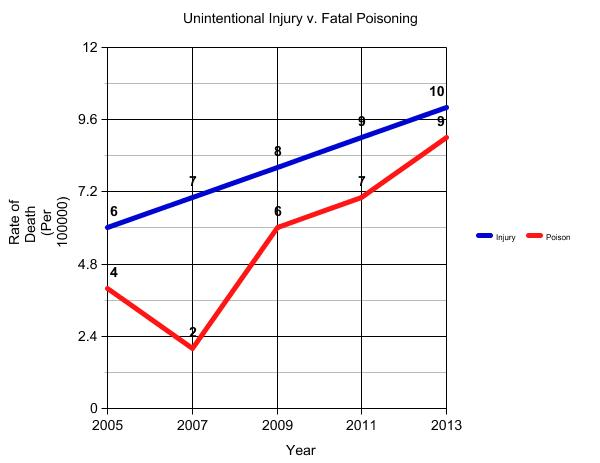

```{r setup, include = FALSE}
knitr::opts_chunk$set(echo = TRUE)
source("analysis.R")
library(dplyr)
library(knitr)
excess_deaths <- read.csv("data/excess_deaths.csv", stringsAsFactors = FALSE)
drug_poisoning <- read.csv("data/drug_poisoning.csv", stringsAsFactors = FALSE)
```

## Section 1. Problem Domain Description
The two datasets that our group chose to analyze are Drug Poisoning Mortality Rates and Excess Deaths from the Five Leading Causes of Death. This domain is worth analyzing because the two datasets can be compared to figure out whether excess deaths or posioning have a larger impact on the United States mortality rate. Furthermore, by critically assesing the data, we can potentially figure out possible measures that could be taken to best address mortality rates from these causes in the United States that could prevent deaths and lower the mortality rate.

To die from drug poisoning means that the cause of death was from an excess of a toxic chemical in the body. There are three main categories in which these deaths fall under: unintentional, suicide, and homocide. There is also a fourth category in which the intent was not clear. 

Excess deaths are definied as "deaths that exceed the numbers that would be expected if the death rates of states with the lowest rates (benchmarks) occurred across all states." [data.gov](https://catalog.data.gov/dataset/nchs-potentially-excess-deaths-from-the-five-leading-causes-of-death) The five leading causes of death in this dataset are: Cancer, Chronic Lower Respiratory Disease, Stroke, Heart Disease, and Unintentional Injury. 


### Section 1.1 Critical Analysis Questions

**How are the rates of unintentional injury related to the rates of fatal poisoning in the United States from 2005-2015 (Jamie)**
This question is of interest because by analyzing the unintentional death rates from injury and comparing them to rates of drug poisoning, we can understand how strongly drug use correlates with deaths from unintentional injury. It is known that drugs inhibit a person's judgement and coordination, which may lead to injuries. We can analyze the data in the years that they overlap and compare the death rates from unintentional injury to poisoning.

**How does the trend of change of fatal poisoning over the years compare to those of the other causes of death? (Sangwon)**
This question will reveal if there has been a consistent trend (i.e. decrease of fata poisoning over the years), and if so, how the rate of that change compares to the rate of other changes. This will represent if fatal poisoning has been a low or high priority for prevention compared to other causes of death.

## Section 2. Data Description

## Section 3. Preliminary Analysis

```{r summary_tables, echo = FALSE}
summarized_excess_deaths <- summarize_excess_deaths(excess_deaths)
summarized_drug_poisoning <- summarize_drug_poisoning(drug_poisoning)

kable(summarized_excess_deaths)
kable(summarized_drug_poisoning)
```

## Section 4. Proposed Data Presentation



A line graph would be effective in displaying the correlation between death from unintentional injury and poisoning because you can see how closely the trends of the two lines relate over time. Looking to see if the lines move the same direction over time will show how closely related the two are. 
