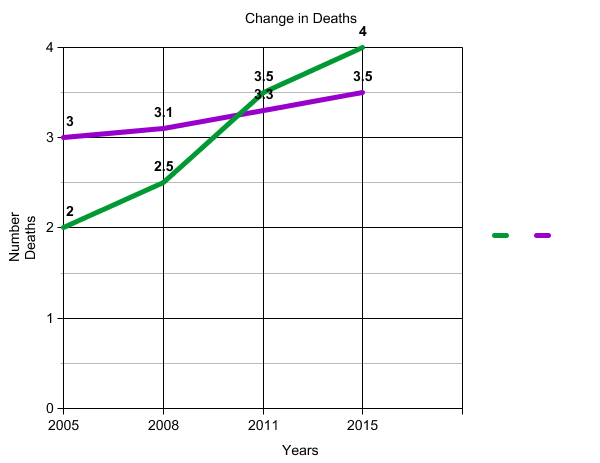

```{r setup, include = FALSE}
knitr::opts_chunk$set(echo = TRUE)
source("analysis.R")

library(dplyr)
library(knitr)
excess_deaths <- read.csv("data/excess_deaths.csv", stringsAsFactors = FALSE)
drug_poisoning <- read.csv("data/drug_poisoning.csv", stringsAsFactors = FALSE)
```

## Section 1. Problem Domain Description
The two datasets that our group chose to analyze are Drug Poisoning Mortality Rates and Excess Deaths from the Five Leading Causes of Death. This domain is worth analyzing because the two datasets can be compared to figure out whether excess deaths or posioning have a larger impact on the United States mortality rate. Furthermore, by critically assesing the data, we can potentially figure out possible measures that could be taken to best address mortality rates from these causes in the United States that could prevent deaths and lower the mortality rate.

To die from drug poisoning means that the cause of death was from an excess of a toxic chemical in the body. There are three main categories in which these deaths fall under: unintentional, suicide, and homocide. There is also a fourth category in which the intent was not clear. 

Excess deaths are definied as "deaths that exceed the numbers that would be expected if the death rates of states with the lowest rates (benchmarks) occurred across all states." [data.gov](https://catalog.data.gov/dataset/nchs-potentially-excess-deaths-from-the-five-leading-causes-of-death) The five leading causes of death in this dataset are: Cancer, Chronic Lower Respiratory Disease, Stroke, Heart Disease, and Unintentional Injury.


### Section 1.1 Critical Analysis Questions
**Which percentage of deaths to population (drug usage or heart disease) has seen a bigger increase between the years of 2005-2015? (Connor) **
This question will provide us with a unique insight as to whether heart disease or drug usage has become an increasing problem in the past 10 years and will provide us with data that can be considered in policy implementation to help lower these numbers. *In this case, the past 10 years will be 2005-2015; the most recent data provided. 

**How are the rates of unintentional injury related to the rates of fatal poisoning in the United States from 2005-2015 (Jamie)**
This question is of interest because by analyzing the unintentional death rates from injury and comparing them to rates of drug poisoning, we can understand how strongly drug use correlates with deaths from unintentional injury. It is known that drugs inhibit a person's judgement and coordination, which may lead to injuries. We can analyze the data in the years that they overlap and compare the death rates from unintentional injury to poisoning.

**How does the trend of change of fatal poisoning over the years compare to those of the other causes of death? (Sangwon)**
This question will reveal if there has been a consistent trend (i.e. decrease of fata poisoning over the years), and if so, how the rate of that change compares to the rate of other changes. This will represent if fatal poisoning has been a low or high priority for prevention compared to other causes of death.

**How does the rate of fatal poisoning compare to the rates of the five leading causes of death in the excess death dataset? (Esha)**
This question is of interest to us because by comparing the rates of fatal poisoning to the rates of the leading causes of death, we could potentially see whether or not there is some overlap in these categories. Therefore by adressing the country's problem of death from drug poisoning we could also lower the excess death rate. 


## Section 2. Data Description
```{r data_description, echo = FALSE}
drug_first_three <- knitr::kable(sorted_drug_data[1:3, ])
excess_death_first_three <- knitr::kable(sorted_excess_death_data[1:3, ])
```
The two data sets that are being used in this report are *Drug Poisoning Mortality by State* and *Potentially Excess Deaths from the Five Leading Causes of Death*. The former contains state names along with statistics about drug mortality, which is sorted by categories such as race and gender. The latter deals with the five leading causes of death, also broken down by state and containing statistics on death rates. The data concerning drugs was originally collected by the National Center for Health Statistics. National Vital Statistics System: Mortality data, and can be found online ([here]( http://www.cdc.gov/nchs/deaths.htm)). Likewise, the date concerning excess deaths was collected by CDC/NCHS, National Vital Statistics System ([more info](http://www.cdc.gov/nchs/deaths.htm)), and mortality data and CDC WONDER ([more info](http://wonder.cdc.gov)).

*Drug Poisoning Mortality by State Data Sample:* 
`r drug_first_three`

Glossary:  
- State: The place where the data is collected from.      
- Year: The year the data was collected.      
- Age.Group: Splits up the data by ranges in age (65â???"74 for example would be those aged between 65 and 74).  
- Race.and.Hispanic.Origin: Organizes the data by race, using hispanic as the default race (Ex: non-hispanic black).  
- Deaths: Drug related deaths.  
- Population: Total population of the demographic.  
- Crude.Death.Rate: The percentage of deaths over the population. The percent of drug related deaths for the stated data.   
   
  *The full, raw data set can be downloaded [here]( https://data.cdc.gov/api/views/xbxb-epbu/rows.csv?accessType=DOWNLOAD).   
  
*Potentially Excess Deaths from the Five Leading Causes of Death Data Sample:* 
`r excess_death_first_three`
Glossary: 
- Year: The year the data was collected.   
- Cause.of.Death: States the cause of death from among the top 5 causes of death in the US.   
- State: The place where the data is collected from.   
- Age.Range: The range of ages that the data pertains to.   
- Benchmark: The number that the expected deaths column is based off of. As the data can   change over time, so can the benchmark, so multiple are used to ensure more presise results.  
- Locality: Shows whether the data comes from metropolitan areas, nonmetropolitan, or both.  
- Observed.Deaths: The total number of deaths as a result of the cause of death.   
- Population: Total population of the demographic.    
- Expected.Deaths: The number of deaths due to the cause of death that is predicted using the benchmark.   
- Potentially.Excessive.Deaths: Deaths that were statistically predicted to not occur that *did* occur in the given period.   
- Percent.Potentially.Excessive.Deaths: The percent of Potentially.Excessive.Deaths over population.   
*The full, raw data set can be downloaded [here](https://data.cdc.gov/api/views/vdpk-qzpr/rows.csv?accessType=DOWNLOAD).


## Section 3. Preliminary Analysis

### Excess Deaths
```{r excess_deaths_summary, echo = FALSE}
summarized_excess_deaths <- summarize_excess_deaths(excess_deaths)
kable(summarized_excess_deaths)
```

### Drug Poisoning
```{r drug_poisoning_summary, echo = FALSE}
summarized_drug_poisoning <- summarize_drug_poisoning(drug_poisoning)
kable(summarized_drug_poisoning)
```

### High Level Answers to Questions

**Which percentage of deaths to population (drug usage or heart disease) has seen a bigger increase between the years of 2005-2015?** 
 By taking the average number of potentially excess deaths from the year 2005 and comparing it to the 2015 average, there is an increase in the number of potentially excessive deaths. Similarily, there is also an increase between the years 2005-2015 in the average amount of drug poisoning. However, the average increase in drug poisoning deaths is far greater than potentially excess deaths, suggesting that funds, policies, etc. should focus on solving the drug crisis rather then providing additional medical care to non-metropolitan areas.   
**How are the rates of unintentional injury related to the rates of fatal poisoning in the United States from 2005-2015?**

By looking at the average rates of death from unintentional injury and poisoning per year, we can see a general trend that when the average rate of unintentional injury goes up, the average rate of poisoning also goes up.

**How does the trend of change of fatal poisoning over the years compare to those of the other causes of death?**

Looking at the national total deaths for each cause over the years, it appears that deaths from fatal poisoning has increased at a comparatively higher rate compared to deaths from other causes.

### Comparison between features of the two data sets
*Comparing average rate of excess deaths per year and average rate of death by drug poisoning*

```{r comparison, echo = FALSE}
kable(excess_death_rate)

kable(poisoning_deaths)
```

When looking at these two tables, we can see that the average rates of excess deaths are far greater than that of the rates from drug poisoning, which is expected, since the excess deaths are from the top five causes of the death in the United States. When comparing the fluctuations of the rates between years, we can see that they fluctuate together (rate rises or declines together) only about half the time from the data prvoided (2005-2015).

### Analysis with Combined Data
*finding which state has the highest combined rate of excess death and drug poisoning*

After analysis of joining the two data sets, we found that the state with the highest combined percentage of excess deaths and drug poisoning deaths was Mississippi. 

``` {r highest_rate_state, echo = FALSE}
kable(highest_avg)
```


## Section 4. Proposed Data Presentation


A line graph would be effective in displaying the correlation between death from unintentional injury and poisoning because you can see how closely the trends of the two lines relate over time. Looking to see if the lines move the same direction over time will show how closely related the two are. 


A line graph showing the rates or changes in rates of death from each cause would be effective in showing how the trend for each cause of death over the years, especially drug poisoning compared to other causes.

 

A line graph will allow for an easy visualization of the change in death number for excessive and drug over the fifteen year period. The greater change in deaths can be observed from the larger vertical distance, which will be the key to answering this question. 